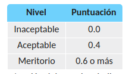

# Practica de Ejercicios de Python 

## Ejercicio 1 
Escribir un programa que pregunte al usuario su edad y muestre por pantalla si es mayor de edad o no.

___

## Ejercicio 2

Escribir un programa que almacene la cadena de
caracteres *contraseña* en una variable, pregunte al usuario por la contraseña e imprima por pantalla si la contraseña introducida por el usuario coidicen con la guardada en la variable sin tener en cuenta mayúsculas y minúsculas

Utilizo el modulo 

~~~
from getpass import getpass
~~~

Para ocultar la contraseña ingresada por la terminal

___

## Ejercicio 3

Escribir un programa que pida al usuario dos números y muestre por pantalla su división. Si el divisor es cero el programa debe mostrar un error 

___

## Ejercicio 4

Escribir un programa que pida al usuario un número entero y muestre por pantalla si es par o impar 

___

## Ejercicio 5

Para tributar un determinado impuesto se debe ser mayor de 16 años y tener unos ingresos iguales o superiores a 1000 € mensuales. Escribir un programa que pregunte al usuario su edad y sus ingresos mensuales y muestre por pantalla si el usuario tiene que tributar o no.

## Ejercicio 6

Los alumnos de un curso se han divido en dos grupos A y B de acuerdo al sexo y el nombre. El grupo A esta formado por las mujeres con un nombre anterior a la M  y los hombres con un nombre posterior a la N y el grupo B por el resto. Escribir un programa que pregunte al usuario su nombre y sexo, y muestre por pantalla el grupo que le corresponde

## Ejercicio 7 

Los tramos impositivos para la declaración de la renta en un determinado país son los siguientes:

Escribir un programa que pregunte al usuario su renta anual y muestre por pantalla el tipo impositivo que le corresponde

## Ejercicio 8

En una determinada empresa, sus empleados son evaluados al fina de cada año. Los puntos que pueden obtener en la evaluación comienzan en 0.0 y pueden ir aumentando, traduciéndose en mejor beneficios. Los puntos que pueden conseguir los empleados pueden ser 0.0, 0.4, 0.6 o más, pero en valores intermedios entre las cifras mencionadas. A continuación se muestra una tabla con los nivles correspondientes a cada puntuación. La cantidad de dinero conseguida en cada nivel es de 2.400€ multiplicada por la puntuación del nivel

Escrbir un programa que lea la puntuación del usuario e indique su nivel de rendimiento, así como la cantidad de dinero que recibirá el usuario